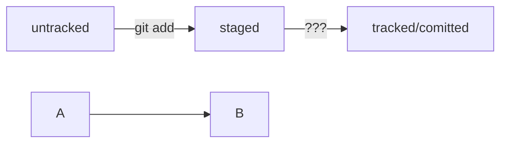

# заголовок1

ываыфа

```go
func
```

```bash
ls - la
```
```html
<h1>А я просто текст</h1>
```

```mermaid
graph LR;
  untracked -- "git add" --> staged;
  staged    -- "???"     --> tracked/comitted;

%% стрелка без текста для примера: 
  A --> B;
``` 
